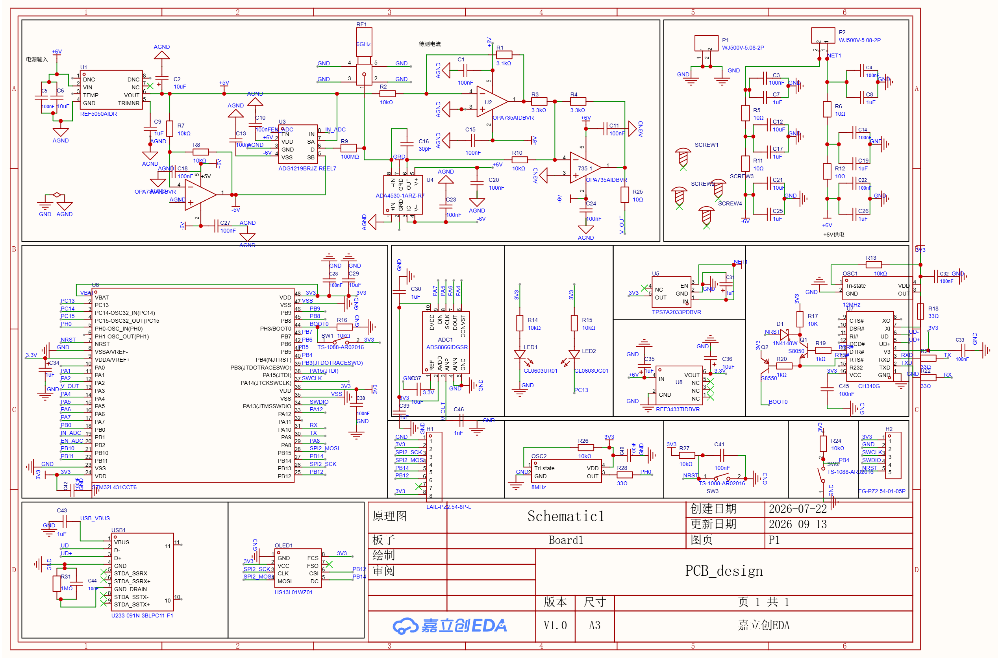

# 纳安表 (Nano-Ammeter)

基于电荷平衡原理的微弱电流测量仪，面向光电效应、脉冲电流等 pA 级测量场景。
硬件、固件、上位机与 PC 脚本全部开源。

## 1. 性能

| 项目 | 指标 | 条件 |
|---|---|---|
| 直流量程 | ±45 nA | 受参考电流 ±50 nA 限制 |
| 显示分辨率 | 0.01 pA | 固件量化 |
| 单次重复性 | 0.027 pA | 50 s 积分窗，1 pA–500 pA 段 31 点合并 |
| 线性度（校准后）| 0.0046 %FS | 162 点，满量程 ±45 nA |
| 脉冲峰值 | 4.2 µA | 超直流量程 93 倍，偏差 −0.58% |

装置输出量即积分窗口内的平均电流

$$I_{\text{out}}=\frac{1}{\tau}\int_{t-\tau}^{t} i(t)\,\mathrm{d}t$$

故对脉冲输入无需峰值检波、频谱搬移或同步采样，峰值远超直流量程时仍可正确读出等效平均值。

## 2. 仓库结构

| 目录 | 内容 |
|---|---|
| [`hardware/`](hardware/) | 嘉立创 EDA 源工程（含 BOM、网表）、原理图、4 层 Gerber |
| [`firmware-v1/`](firmware-v1/) | 固件，现役版本 |
| [`firmware-v0/`](firmware-v0/) | 固件，2026-09-13 冻结基线，只读 |
| [`pc-console/`](pc-console/) | 上位机：Web Serial 控制台 |
| [`scripts/smu/`](scripts/smu/) | 2636B 源表控制与采集 |
| [`scripts/plotting/`](scripts/plotting/) | 绘图 |
| [`scripts/analysis/`](scripts/analysis/) | 标定、拟合、线性度分析 |
| [`scripts/lib/`](scripts/lib/) | 公共模块，被上述脚本 import |
| [`scripts/misc/`](scripts/misc/) | 烧录与杂项 |
| [`docs/`](docs/) | 排障记录、实验方案、论文节 |
| [`data/`](data/) | 实测数据 |
| [`image_paper/`](image_paper/) | 论文插图 |
| [`prototypes/`](prototypes/) | 历史固件归档，只读 |

脚本索引与依赖关系见 [`scripts/README.md`](scripts/README.md)。

## 3. 硬件 `hardware/`

| 文件 | 说明 |
|---|---|
| `jlc-project.zip` | 嘉立创 EDA 专业版工程（原理图 + PCB + BOM + 网表）|
| `Schematic.png` | 原理图 |
| `gerber/` | Gerber 制板文件（4 层板 + 3 个钻孔文件）|
| `enclosure.stp` | 铝合金外壳 3D 模型（STEP）|

`jlc-project.zip` 解压得 `.epro2`，经嘉立创 EDA（专业版）`文件 → 打开工程` 导入；
元件属性含立创商城料号，可直接下单。



**板级配置**

| 项 | 器件 |
|---|---|
| MCU | STM32L431CCT6 |
| 模拟前端 | ADA4530 静电计运放（积分电容 100 pF）+ ADG1219 参考开关 + OPA735 电平移位 |
| 采集 | 内置 12-bit ADC（控制路）+ ADS8866 16-bit（观测路，SPI）|
| 显示 / 通信 | SH1106 1.3" OLED（SPI）/ 板载 CH340G（USB-C）|
| 参考电流 | ±50 nA（±5 V 经 100 MΩ，标称值）|

> 元件值均为标称值，绝对增益尚未标定；实测参考电流与积分电容值见
> [`firmware-v1/Core/Inc/current.h`](firmware-v1/Core/Inc/current.h)。

## 4. 固件 `firmware-v1/`

STM32L431 固件，CMake 工程（亦可由 CubeIDE 打开）。**固件改动仅限本目录**；
`firmware-v0/` 为冻结基线（只读），缺 50 s 长窗、拉回相、`X=` 字段与 `T<ms>` 指令，
不支持亚纳安测量。

`Core/Src/` 模块划分：

| 模块 | 职责 |
|---|---|
| `main.c` | 主循环、串口指令分发 |
| `measurement_state.c` | 测量状态机（空闲 / 拉回相 / 模式一 / 模式二）|
| `current.c` | ±50 nA 参考、式(6) 计算、分段校准 |
| `adc.c` `ads8866.c` | 双路同拍采集 |
| `cal_coef.c` `cal_mode.c` | 校准系数存储（Flash + CRC）、标定模式 |
| `sh1106.c` | OLED 显示 |
| `uart.c` | 串口协议、波形回传 |
| `tim.c` `spi.c` `gpio.c` `button.c` | 外设 |

```bash
cd firmware-v1
cmake --preset Debug && cmake --build build/Debug
# 产物：build/Debug/firmware-v1.elf
```

烧录：ST-Link + OpenOCD（`scripts/misc/run_app.sh` 可绕过"复位进 ROM bootloader"），
或串口 bootloader（`scripts/misc/uart_flash.py`）。

串口协议见 §9；固件内部细节见 [`firmware-v1/README.md`](firmware-v1/README.md)。

## 5. 2636B 源表控制与采集 `scripts/smu/`

Keithley 2636B（LAN / pyvisa），用于标定与表征；另含本装置的串口采集。

| 脚本 | 用途 |
|---|---|
| `cal_sweep.py` | 底层驱动（串口 + 源表 + 测量原语）|
| `sweep_dense.py` | 密集电流网格扫描（整窗回传）|
| `sweep_broad.py` `sweep_dc.py` `sweep_iv.py` | 宽范围 / 直流 / 光电探测器 I–V 扫描 |
| `sweep_pulse.py` | 脉冲采集（TSP 脉冲源）|
| `nanoammeter_capture.py` | 单次采集 → npz / png / log（v1 需 `--no-noise`）|
| `test_smu.py` | 源表连通与功能自检 |
| `warm_test.py` | 预热必要性对照 |
| `pulse_real.py` `pulse_probe.py` `pulse_introspect.py` | 脉冲重建 / 能力探针 / 内省 |
| `measure_transient.py` `switching_times.py` `range_test.py` | 瞬态 / 开关时序 / 量程效应 |
| `test_capture.py` | `nanoammeter_capture` 离线回归（26 项）|

```bash
pip install pyvisa pyserial numpy matplotlib
python scripts/smu/test_smu.py
python scripts/smu/nanoammeter_capture.py COM8 --no-noise
```

> `cal_sweep.py` 的 `MEASURE_TIMEOUT_S` 必须覆盖固件最长窗口（50 s → 已设 60）。

## 6. 绘图 `scripts/plotting/`

论文插图生成，统一风格见 `scripts/lib/paper_style.py`。

| 脚本 | 输出 |
|---|---|
| `paper_figs.py` | 低电流段图 |
| `paper_lin10_fig.py` | ±10 nA 组 |
| `paper_pulse_fig.py` | 脉冲四格图 |
| `photoelectric_fig.py` `photo_data_fig.py` `dark_current_fig.py` | 光电效应 / 光电数据 / 暗电流 |
| `residual_pct_plot.py` | ±5–45 nA 残差百分比图 |
| `console_figure.py` | 控制台截图（注入真实数据后 Chrome headless 渲染）|

## 7. 分析 `scripts/analysis/`

标定常数拟合、线性度、误差预算与脉冲分析。

| 脚本 | 用途 |
|---|---|
| `fit_constants.m` `make_fit_csv.py` | 三常数（M、I₊、I₋）最小二乘拟合 |
| `fit_linearity.py` `fit_tau.py` | 早期拟合链 |
| `cal_table.py` `detect_limit.py` | 标定表 / 检测下限 |
| `lowI_compare.py` | 误差链：装置 / 设定 / 源表回读 |
| `outlier_test.py` `.m` | 离群值检验（Python / MATLAB 互校）|
| `seg0_budget.py` `seg0_joint_fit.py` `fsw_hypothesis.py` | 低电流段偏置分析与假设检验 |
| `reproducibility.py` `endpoint_codes.py` `range_effect.py` `window_sawtooth.py` `raw_recalc.py` | 复现性 / 端点码 / 量程效应 / 锯齿形态 / 原始码反推 |
| `analyze_pulse.py` `sim_pulse_recover.py` | 脉冲分析 / 恢复仿真 |
| `matlab_utf8.sh` | MATLAB UTF-8 包装 |

推导见 [`docs/校准方案推导.md`](docs/校准方案推导.md)，操作步骤见
[`docs/拟合操作指南.md`](docs/拟合操作指南.md)。

## 8. 上位机 `pc-console/`

单文件 Web Serial 控制台，无外部依赖，Chrome / Edge 直接打开 `console.html`。

| 文件 | 说明 |
|---|---|
| `console.html` | 控制台；「一键采集」执行 `E→S→B→X→E`，「实验表征」面板负责逐点采集与系数收发（仅 v1）|
| `console_selftest.js` | 整体自测（36 项）|
| `console_src/archive.js` | 数据存档与命名模块，内联进 HTML |
| `console_src/archive_test.js` | 模块自测（18 项）|

```bash
node pc-console/console_src/archive_test.js
node pc-console/console_selftest.js
```

## 9. 测量与协议

**积分窗口**

| 电流 | 窗口 |
|---|---|
| $\lvert I \rvert \ge 1$ nA | 1 s |
| $\lvert I \rvert < 1$ nA | 50 s |

实测（1 pA–500 pA 段，31 点合并）：10 s 窗单次重复性 0.1153 pA，50 s 窗 0.0267 pA。
亚纳安段统一取 50 s，以保证光电效应实验 I–V 曲线过零点的判读精度。

**串口协议（115200 8N1）**

| 指令 | 功能 |
|---|---|
| `S` | 单次测量（测完回空闲）|
| `D` | 查询最近结果 |
| `B` / `X` | 回传窗口波形（内置 ADC / ADS8866），`"<tag> <count>\r\n"` + u16 小端 + 校验和 |
| `E` | 观测通路自检 |
| `Q` `Q<q_aC>,<i+_pA>,<i-_pA>` | 物理常数查询 / 写入（Flash，掉电不丢）|
| `K<段>,<a_ppm>,<b_fA>` `C` `Z` | 分段校准系数写入 / 查询 / 清除 |
| `T<ms>` | 强制积分窗口（`T0` 回自动）|

指令大小写不敏感，测量期间忽略。

## 10. 标定

式(6) 化简后仅需三个外部常数：

```
I = q·(c2 − c1)/T窗 − (m·I₊ + n·I₋)/N
  q = C·VREF/(65536·GAIN)   库仑/码   标称 1.5259e-14
  I₊, I₋                    参考电流  标称 ±50 nA
```

简化：① 电平移位 1.55 V 在 `Vo1 − Vo2` 中相消，无需标定；② `q` 的四个因子只测乘积。

| 量 | 方法 |
|---|---|
| `I₊` / `I₋` | 闭环最小二乘（`analysis/fit_constants.m`）|
| `q` | 灌已知电流开环测量，不依赖锯齿相位假设 |

> `q` 不可用"参考断开 + 灌电流"法：`EN=0` 为 Hi-Z 而非 0 A，浮空节点寄生电容会注入
> 衰减暂态电荷。见 [`docs/调试与排障.md`](docs/调试与排障.md)。

`firmware-v0` 常数存编译期宏；`firmware-v1` 存 Flash 末页（带 CRC），串口 `Q`/`K` 读写，
重新标定无需重编译。

## 11. 排障

调试手段、工程结论与待复核项见 [`docs/调试与排障.md`](docs/调试与排障.md)。

> 该记录对应一版存在设计缺陷的硬件，其中的硬件接线与结论不具通用性；作者将在开源方案
> 中发布修正后的硬件版本，届时以新版文档为准。

## 许可

尚未选定。
（硬件建议 CERN-OHL-P 或 CC BY-SA；固件与脚本建议 MIT 或 Apache-2.0。）
